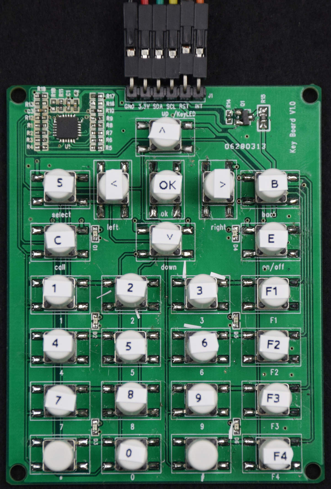

This is a simple keypad to test the SN7326 I2C keypad controller in the 25 button configuration we wanted for the WiPhone. Posting in the hopes it might be useful to someone else.  
{width="3.0in"}

### Overview (from the SN7326 datasheet)
The SN7326 is a 64 key, key-scan controller. It offloads the burden of keyboard scanning from the host processor.  
The SN7326 supports keypad matrix of up to 8×8. Key press and release events are encoded into a byte format and loaded into a key event register for retrieval by the host processor. The SN7326 integrates a debounce function which rejects false or transient key switch activities.  
The interrupt output (INT) is used to signify if there are any keypad activities. To minimize power, the SN7326 automatically enters a low power standby mode when there is no keypad, I/O, or host activity.

### Features:
  - 2.4V to 5.5V operation
  - I2C interface
  - multi-key press detection
  - 0.3μA (typ.) standby current
  - 4x4mm QFN-24 package

The design is in PADS. Everything is there to fabricate it yourself. BOM, gerbers, PDF schematic + PADS schematic and layout.

Pinout:  
**Pin 1:** GND  
**Pin 2:** VDD  
**Pin 3:** SDA  
**Pin 4:** SCL  
**Pin 5:** LED/RST  
**Pin 6:** INT  

